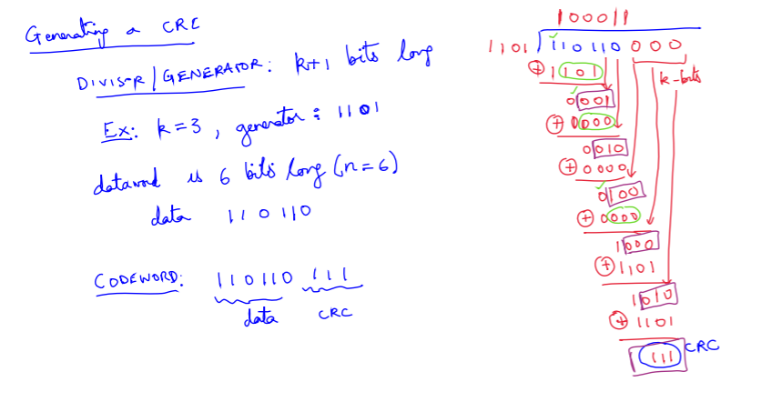

## Error Detection

### Cyclic Redundancy Check (CRC)

Cyclic redundancy check is an error detecting code used in networks and storage devices to detect bit errors in the raw data. CRCs are so called because the check (data verification) value is a redundancy and the algorithm is based on [cyclic codes](https://en.wikipedia.org/wiki/Cyclic_code).

CRCs are used to encode messages by adding a fixed length check value for detecting errors. Cyclic codes are simple to implement and are well suited for detection of [burst errors](https://en.wikipedia.org/wiki/Burst_error). Typically an $$n$$-bit CRC applied to a data block of arbitrary length will detect any single error burst of up to $$n$$ bits.

In CRC codewords are used to detect bit errors. A codeword is formed by concatenating the $$n$$-bits of data with a $$k$$-bit check value of CRC. Each of the $$2^n$$ possible $$n$$ bit data sequence is mapped to a unique $$n+k$$ bit codeword. Whenever an error occurs in a bit the codeword changes and becomes invalid. But what if a codeword changes into another codeword?

##### Hamming Distance

Hamming distance between two equal length string is the number of positions at which the corresponding symbols are different, or the minimum number of errors that could have transformed one string into the other.

Hamming distance of a CRC is the minimum HD over all pairs of codewords. We want the hamming distance to be as large as possible for CRC so that it requires many bit error for a codeword to change into another codeword.

##### Galois Field - GF(2)

GF(2) is the Galois field of two elements with its additive and multiplicative identities respectively denoted 0 and 1.

It's addition is same as **logical XOR** and multiplication is same as **logical AND**. Also subtraction is same as addition.

<table style="text-align: center; width: 20%; margin-left: 28%; float: left;">
  <tbody>
    <tr style="background: #f9f9f9;">
      <th>+</th>
      <th>0</th>
      <th>1</th>
    </tr>
    <tr>
      <th style="background: #f9f9f9;">0</th>
      <td style="background: white;">0</td>
      <td style="background: white;">1</td>
    </tr>
    <tr>
      <th style="background: #f9f9f9;">1</th>
      <td style="background: white;">1</td>
      <td style="background: white;">0</td>
    </tr>
  </tbody>
</table>

<table style="text-align: center; width: 20%; margin-right: 28%; float: right;">
  <tbody>
    <tr style="background: #f9f9f9;">
      <th>×	</th>
      <th>0</th>
      <th>1</th>
    </tr>
    <tr>
      <th style="background: #f9f9f9;">0</th>
      <td style="background: white;">0</td>
      <td style="background: white;">0</td>
    </tr>
    <tr>
      <th style="background: #f9f9f9;">1</th>
      <td style="background: white;">0</td>
      <td style="background: white;">1</td>
    </tr>
  </tbody>
</table>

#### Generating a CRC

For generating a CRC code we need a generator polynomial. We divide the data sequence with this generator polynomial and the remainder of this division is the CRC code.

Here is an example.

  

##### One (any odd number) bit errors

This is the simplest error-detection system. Intuitively for detecting 1 bit error we just need to check the parity of number of bits equal to 0 (or 1). If there is a 1 bit error than the number of bits equal to 0 (or 1) will change by $$\pm 1$$. Hence we can detect single bit error using a parity bit that is equal to XOR ($$\oplus$$) of all the bits in the data.

For generating CRC for single bit error the generator polynomial is $$x+$$ and the CRC is called CRC-1.

This also works for any odd number of errors because then also the parity changes.

##### Two bit errors

--------------------------------**_TODO_**--------------------------------

<!-- TODO: Add "two bit errors" section here -->

##### Burst of errors

A $$n$$-bit CRC can detect all burst errors of length of $$n+1$$ except for one pattern, the CRC polynomial itself. For detecting a burst error the CRC polynomial should not divide the error polynomial.

A degree $$n$$ polynomial that have $$x^0=1$$ as a term, cannot divide any polynomial, except itself, with degree $$\leq n$$. All CRCs polynomial have $$x^0=1$$ as a term, hence a $$n$$-bit CRC can detect all burst errors of length of $$n+1$$, except itself.

### ARQ and State Diagrams

#### Automatic Repeat Request

It is an error-control method for data transmission that uses acknowledgements and timeouts to achieve reliable data transmission over unreliable communication channels. If the sender does not receiver an acknowledgement before timeout, it retransmit the packet until it receives an acknowledgement.

There are 3 types of ARQ protocols

- [Stop and Wait ARQ](https://en.wikipedia.org/wiki/Stop-and-wait_ARQ)
- [Go Back-N ARQ](https://en.wikipedia.org/wiki/Go-Back-N_ARQ)
- [Selective Repeat/Reject ARQ](https://en.wikipedia.org/wiki/Selective_Repeat_ARQ)

Also known as Automatic Repeat Query. WiFi uses ARQ.
