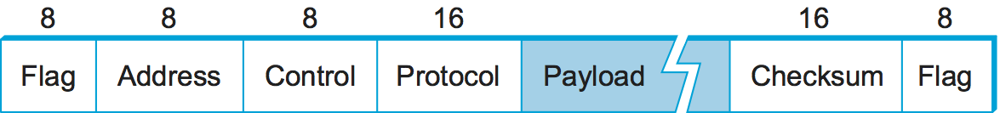

## Framing

In the line_coding lecture we saw how to transmit a sequence of bits over a point-to-point link, or from adaptor to adaptor. From previous chapters we know that blocks of data (called _frames_ at this level), not bit streams, are exchanged between nodes. The network adaptor at the nodes handles the exchange of frames. Recognizing exactly what set of bits constitute a frame, or determining start and end of a frame, is the central challenge faced by the adaptor. There are many ways to address this framing problem. Here three different protocols are described to address this problem. Here we are discussing framing in context of point-to-point link but this is a fundamental problem that must also be addressed in multiple access networks like Ethernet and Wi-Fi.

### Some Protocols

#### Byte-Oriented Protocols (PPP)

It is one of the oldest approach to framing. In this protocol each frame is viewed as a collection of bytes (characters) instead of bits. At high level, there are two approaches to this type of protocols.

The first is to use special characters known as _sentinel characters_ to indicate start and end of a frame. The data portion of the frame is sometimes contained between two or more special characters STX (start of text) and ETX (end of text). BISYNC used this approach. The problem with this is that one of the sentinel characters might appear in the data portion of the frame. The standard way of solving this problem is by "escaping" the character by preceding it with a DLE (data-link-escape) character Whenever it appears in the body of a frame. This approach is often called character stuffing because extra characters are inserted in the data portion of the frame. The **Point-to-Point Protocol** (PPP), which is commonly used to carry Internet Protocol packets over various sorts of point-to-point links, uses this method.

  

The alternative of this is to include the number of bytes in the frame at the beginning of the frame, in the frame header. DDCMP used this approach. One danger with this approach is that a transmission error could corrupt the count field, in which case the end of the frame would not be correctly detected. (A similar problem exists with the sentinel-based approach if the ETX field becomes corrupted.)
