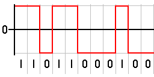

## Line Coding

Line coding is the process of converting data into signal. At the sender's end we convert sequence of bits into digital signal and at the receiver's end the signal is recreated into bits by decoding the signal.

### Types of line coding

#### Non-Return to Zero (NRZ)

In this line coding 1 is represented by a positive voltage and 0 by a negative voltage.

  

The problem with NRZ is that a sequence of several consecutive 1s or 0s means the signal stays constant for a long period of time. There are two problems caused by continuous long strings of 0s or 1s.

The first problem is known as _clock recovery_ problem. The clock recovery problem is that both the sender and receiver's clocks have to be precisely synchronized in order for the receiver to recover the same bits the sender transmits. The receiver tries to synchronize it's clock using the received signal-The Clock Recovery Process. Whenever the signal changes from 1 to 0 or 0 to 1, then the receiver knows it is at a clock cycle boundary and it can resynchronize itself. However, a long period of time without any change in signal leads to _clock drift_. Thus clock recovery depends on having a lot of transitions in the signal.

The second problem is known as _baseline wander_. During the signal transfer the receiver keeps and average of the signal it has received so far and then compare the incoming signal with the average to distinguish between low and high signal. Whenever the signal is significantly lower than the average the receiver concludes that it's a 0; similarly when the signal is much higher than the average the receiver interprets it to be a 1. And when there are too many consecutive 0s or 1s the average voltage wanders from the baseline (hence the name), making it more difficult to detect significant change in the signal.

One approach that addresses this problem is called non-return to zero inverted (NRZI). In this encoding the sender makes a transition from current signal to encode a 1 and stays at the current signal to encode a 0. This only solves problem of consecutive 1s.

  

#### Return to Zero (RZ)

In this line code the signal drops to zero voltage between each bit interval. In this case the signal is self-clocking i.e. the receiver can always resynchronize it's clock using the clock recovery process hence it eliminates the problem of baseline wander.

  

Main disadvantage of RZ encoding is that it requires twice the bandwidth to get the same data transfer rate as compared to NRZ encoding. Another problem is that it uses three levels of voltages. Due to these deficiencies this encoding is not used today. Instead, it has been replaced by Manchester and differential Manchester encodings.

#### Manchester Encoding

In this encoding each bit is represented as either low in first half and high in second half or high in first half and low in second half. It is a self clocking signal.
It is also known as **Phase Encoding** (PE).

There are two conventions for the representation of data. First one specifies 0 as low-high and 1 as high-low. In the second 0 is represented by high-low and 1 by low-high. The second one is used in **IEEE 802.3**.

  

There are two problems in Manchester encoding.

The first is that the receiver needs to know where the signal starts. For solving this problem, a special, known signal called preamble is sent before the actual signal. The receiver figures out the start of the actual signal using the preamble.

The another problem is with the polarity of the signal. If a Manchester encoded signal gets inverted during communication, it is transformed from one convention to other. This ambiguity can be overcome using differential Manchester encoding.

#### Differential Manchester Encoding

In this encoding there is always a transition in the middle of the bit interval. 0s and 1s are determined using the beginning of the bit interval. If there is a transition at the beginning of the interval than the bit is 0. If there is no transition at the beginning then the bit is 1.

This encoding solves the problem of polarity. Unlike Manchester encoding, only presence or absence of transition is used to encode/decode the signal. This coding scheme works same if the signal is inverted.

  

It is also known as Biphase Mark Code, digital frequency modulation, F2F. And it is used in the IEEE 802.5 standard for Token Ring LANs.

#### Other encodings and Baud rate

- 4B/5B Encoding: As the name implies, in this encoding each 4 bit block of data is mapped to a 5 bit block to avoid the problem of consecutive 1s or 0s.
- 8B/6T Encoding: In this encoding 6 voltage levels are used to represent 8 bits on a single signal.
- Baud Rate: Baud rate is the number of signal/symbol changes per second. A symbol refers to one of the several voltage levels in the signal.
